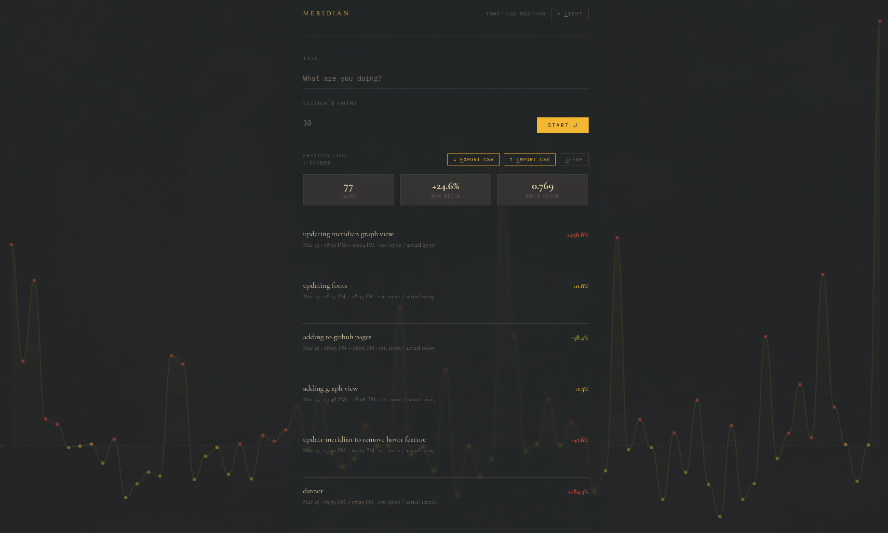

# Meridian

**Time tracking and estimation calibration.**

Meridian helps you measure how accurately you estimate tasks. Log sessions, track how far off your predictions are, and watch your calibration improve over time.

[**Live app →**](https://drakemorrison.github.io/meridian)

---

## Features

- **Session tracking** — enter a task and an estimate, start the timer, stop when done
- **Calibration scoring** — see your average delta and Brier score across all sessions
- **Graph view** — click the background graph to go fullscreen; hover dots for session details, click a dot to jump to that entry
- **Import / Export** — CSV export and import for portability
- **Auto-backup** — point it at a local folder and it saves a CSV on a daily or weekly schedule
- **Light and dark themes**
- **Keyboard shortcuts** — `Enter` to start/stop, `E` to export, `I` to import, `C` to clear, `Escape` to exit graph view

## Usage

No install, no account, no server. All data is stored locally in your browser via `localStorage`. Open the app and start tracking.

## Data

Everything stays in your browser. Nothing is sent anywhere. Use Export CSV to back up your data or move it between devices.
