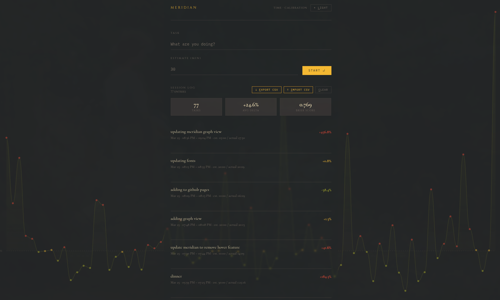

> [!IMPORTANT]
> **This repository has moved.** meridian is now part of [**aristeia**](https://github.com/DrakeMorrison/aristeia), a consolidated suite of self-improvement PWAs.
>
> - Current source: <https://github.com/DrakeMorrison/aristeia/tree/main/meridian>
> - Live app: <https://drakemorrison.github.io/aristeia/meridian/>
>
> Full git history was carried over. This repository is kept for reference and will no longer be updated.

# Meridian

**Time tracking and estimation calibration.**

Meridian helps you measure how accurately you estimate tasks. Log sessions, track how far off your predictions are, and watch your calibration improve over time.

[**Live app →**](https://drakemorrison.github.io/meridian)

---

## Features

- **Session tracking** — enter a task and an estimate, start the timer, stop when done. Estimate `0` skips the prediction entirely and just logs the time (excluded from calibration)
- **Calibration scoring** — see your average delta and Brier score across all sessions
- **Graph view** — click the background graph to go fullscreen; hover dots for session details, click a dot to jump to that entry
- **Import / Export** — CSV export and import for portability
- **Daily summary** — one click copies today's sessions as Slack-ready text
- **Auto-backup** — point it at a local folder and it saves a CSV on a daily or weekly schedule
- **Light and dark themes**
- **Keyboard shortcuts** — `Enter` to start/stop, `E` to export, `I` to import, `C` to clear, `Y` to copy daily summary, `Escape` to exit graph view

## Usage

No install, no account, no server. All data is stored locally in your browser via `localStorage`. Open the app and start tracking.

## Data

Everything stays in your browser. Nothing is sent anywhere. Use Export CSV to back up your data or move it between devices.
